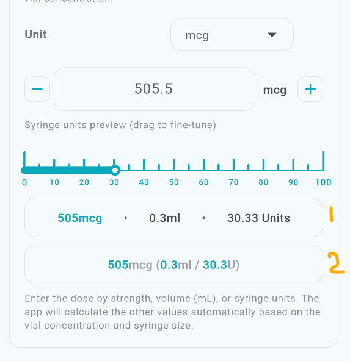

# Add Schedule

## Step 1

- [x] Could not select a medicaoint that I recently added. it was not appearring. 
- [x] Tablets:
	- [x] Too much space underneath the Helper text for Dose type. 

- MDV:
- [x] When incrementing via the buttons, it should always increment in Syringe units of 1 or multiples of 1. no matter what dose unit is used. Or round it off. As a human cannot draw 7.2 units into a syringe. Thats impossible. 
- [x] I cannot continue on the step 1 screen. Something is not right and it wont proceed when hitting next. I understand now, this is to do with the Next button inolmenetation. So when pressing next, can it highlight the field its moved to with a little animated flash? Then once its stating Next Opage, it doesnt actually move to the next page. 
- [x] MDV has 2 summary formaula calcualtion cards.  Remove the number 1 and keep number 2. 

## Step 2
- Schedule Pattern:
	

## Step 3

- [x] Remove the legacy add edit schedule screen. I dont want any remaining junk code here to confuse. 

## Recommendations
- [x] Make the medication picker reactive to newly added meds (no manual refresh needed).
- [x] Standardize helper-text spacing in Step 1 using design-system spacing constants.
